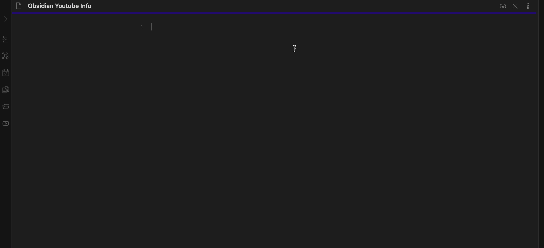

# Obsidian Youtube Info




## What is this plugin for?
문서 첫 줄에 입력된 유튜브 링크를 통해 프론트매터 정보와 미리보기 이미지를 추출합니다.
형식은 다음과 같습니다.

Front Matter information and thumbnails are extracted through the YouTube link entered in the first line of the document.
The format is:

```
---
title: BLACKPINK - ‘Shut Down’ M/V
tag: YG_Entertainment YG 와이지 K-pop BLACKPINK 블랙핑크 블핑 제니 로제 리사 지수 LISA JISOO
  JENNIE ROSÉ BLINK 블링크 BLACKPINK_PINK_VENOM PINK_VENOM 핑크베놈 블랙핑크_핑크베놈
  BLACKPINK_핑크베놈 BORN_PINK BLACKPINK_BORN_PINK 본핑크 블랙핑크_본핑크
published_date: 2022-09-15
today_date: 2022-09-25
complete_date: 2022-09-25
duration: 3M 1S
creator: BLACKPINK
genre: Music
---


# BLACKPINK - ‘Shut Down’ M/V
```


## Usage
새로운 문서를 생성합니다.
문서 첫 줄에 유튜브 링크를 입력합니다.
리본 버튼을 클릭해 Obsidian-Youtube-Info 플러그인을 실행합니다

Create a new document.
Enter the YouTube link in the first line of the document.
Click the ribbon button to launch the Obsidian-Youtube-Info plugin